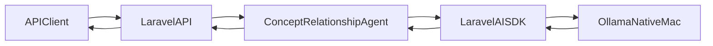

# 02 - Local LLM and AI SDK

## Goals

- Run **Ollama natively on macOS** with a default local model (e.g. `llama3.2:3b`) while keeping the model **configurable**.
- Install and configure `**laravel/ai**` so the Laravel app can call the local LLM from within Sail containers.
- Expose a small, testable surface in the app (agent/service + endpoint) that uses the LLM to generate **lateral concept relationships**.
- Add **unit, feature, and smoke tests** to validate the integration.
- Create a **Bash wrapper script** to start/stop Ollama and Sail in a centralized way.
- Persist this plan in `[Plans/02-Local-LLM-and-AI-SDK.md](Plans/02-Local-LLM-and-AI-SDK.md)`.

## High-Level Architecture

- **Runtime topology**:
  - Ollama runs **on the macOS host** listening on `http://127.0.0.1:11434`.
  - Laravel runs in Sail (`laravel.test` container) and calls Ollama via `http://host.docker.internal:11434`.
- **Laravel AI SDK**:
  - Installed as `laravel/ai` composer dependency.
  - Configured provider `ollama` in `config/ai.php` using env vars (`OLLAMA_BASE_URL`, `OLLAMA_MODEL`, etc.).
  - A dedicated **Agent class** encapsulates the prompt and structured output for lateral concept generation.

A rough data flow:




## Step 1: System-level Ollama Installation (macOS)

1. Document in the plan the macOS steps (no code changes needed):
  - Install Ollama app (DMG or `brew install ollama`).
  - Start the daemon (`ollama serve`) or launch the app.
  - Pull the default model:
    - Default for this project: `**llama3.2:3b**`.
    - Note in docs that `OLLAMA_MODEL` can be changed (e.g. to `llama3.2:1b` or `llama3.1:8b`).
  - Verify with `curl http://127.0.0.1:11434/api/tags`.
2. Add a short **"Local LLM"** section to `README.md` pointing to `[Plans/02-Local-LLM-and-AI-SDK.md](Plans/02-Local-LLM-and-AI-SDK.md)`.

## Step 2: Install Laravel AI SDK

1. Update `composer.json` to require `laravel/ai` (no version pin or a compatible `^1.0` per docs):
  - `"laravel/ai": "^1.0"` in the `require` section.
2. Run inside Sail (documented in the plan):
  - `sail composer require laravel/ai`.
  - `sail artisan vendor:publish --provider="Laravel\\Ai\\AiServiceProvider"`.
  - `sail artisan migrate` to create `agent_conversations` tables.
3. Note in the plan where the new files live:
  - `[config/ai.php](config/ai.php)`.
  - Any new migration files under `database/migrations/`.

## Step 3: Environment & Config for Ollama

1. Extend `.env.example` with AI-related keys:
  - `OLLAMA_API_KEY=` (left blank; documented that Ollama does not require it but the SDK expects a key field).
  - `OLLAMA_BASE_URL=http://host.docker.internal:11434` (so containers talk to host).
  - `OLLAMA_MODEL=llama3.2:3b`.
  - Optionally `AI_DEFAULT_PROVIDER=ollama`.
2. Ensure `config/ai.php` configures the provider:
  - Add an `ollama` entry in the `providers` array:
  - Configure default model for text generation using `OLLAMA_MODEL` when `AI_DEFAULT_PROVIDER=ollama`.
3. Confirm Sail containers can resolve `host.docker.internal` (already configured in `compose.yaml` via `extra_hosts`).

## Step 4: Application Integration (Agent + Service + Endpoint)

1. **Agent class** (AI SDK):
  - Use `php artisan make:agent ConceptRelationshipAgent --structured`.
  - Place in `app/Ai/Agents/ConceptRelationshipAgent.php`.
  - Implement:
    - `instructions()` to explain the lateral-thinking / concept-relationship role.
    - `schema()` to return structured output like:
      ```php
      [
          'seed' => $schema->string()->required(),
          'related_concepts' => $schema->array(
              $schema->object([
                  'concept' => $schema->string()->required(),
                  'rationale' => $schema->string()->nullable(),
                  'strength' => $schema->number()->min(0)->max(1)->nullable(),
              ])
          )->minItems(3)->required(),
      ];
      ```
  - Default provider/model can be passed via `prompt()` parameters using `Lab::Ollama` and `env('OLLAMA_MODEL')`.
2. **Domain-facing service**:
  - Create `app/Services/ConceptRelationshipService.php` that:
    - Accepts a seed concept string.
    - Calls `ConceptRelationshipAgent::make()->prompt(...)`.
    - Normalizes the structured response to a domain DTO/array for the API.
3. **API endpoint**:
  - Add a controller `app/Http/Controllers/Api/ConceptRelationshipController.php` with an action like `generate()` that:
    - Validates input (`seed` string, optional parameters like `count`).
    - Delegates to `ConceptRelationshipService`.
    - Returns JSON in the standard API shape (as described in `.cursorrules/AGENTS.md`), e.g.:
      ```json
      {
        "data": { "seed": "...", "related_concepts": [ ... ] },
        "status": "success"
      }
      ```
  - Wire route in `[routes/api.php](routes/api.php)`:
    - `POST /api/concepts/relationships` -> `ConceptRelationshipController@generate`.

## Step 5: Docker & Networking Considerations

1. Confirm `compose.yaml` already maps `host.docker.internal` (it does) and document how this allows containers to reach the macOS Ollama service.
2. If necessary, add a note in the plan about **alternative URL**:
  - For running the app directly on the host (without Sail), `OLLAMA_BASE_URL` can be `http://127.0.0.1:11434`.
3. No extra container for Ollama is needed in this option, but the plan should explicitly call that out so future you doesn’t add a duplicate Docker service by mistake.

## Step 6: Tests (Unit, Feature, Smoke)

1. **Unit tests** (no real LLM call):
  - File: `[tests/Unit/ConceptRelationshipServiceTest.php](tests/Unit/ConceptRelationshipServiceTest.php)`.
  - Strategy:
    - Mock the AI SDK or `ConceptRelationshipAgent` to return a known structured payload.
    - Assert that `ConceptRelationshipService` correctly maps this to the expected domain array/DTO.
    - Cover error handling paths (e.g. malformed schema, empty results) via mocks.
2. **Feature test** (API-level, faked AI):
  - File: `[tests/Feature/ConceptRelationshipApiTest.php](tests/Feature/ConceptRelationshipApiTest.php)`.
  - Use Laravel AI SDK’s testing facilities (if available) or mock the service bound in the container.
  - Hit `POST /api/concepts/relationships` with a seed concept and assert:
    - HTTP 200.
    - Response JSON structure matches `{ data: { seed, related_concepts: [...] }, status: 'success' }`.
3. **Smoke / integration test** (real Ollama, optional):
  - File: `[tests/Feature/ConceptRelationshipOllamaSmokeTest.php](tests/Feature/ConceptRelationshipOllamaSmokeTest.php)`.
  - Mark with a custom PHPUnit group (e.g. `@group ollama`) and document that it only runs when:
    - `OLLAMA_BASE_URL` is reachable.
    - A flag like `AI_SMOKE_TESTS=1` is set.
  - Test flow:
    - Skip if env flag is not set.
    - Call the service or endpoint end-to-end and assert that some non-empty `related_concepts` are returned.

## Step 7: Bash Dev Script (centralized start/stop)

1. Add a Bash script in the project root, e.g. `[dev.sh](dev.sh)`:
  - Usage: `./dev.sh up` and `./dev.sh down`.
2. `**up` behavior**:
  - Check if Ollama is reachable:
    - e.g. `curl -sSf http://127.0.0.1:11434/api/tags`.
  - If not reachable:
    - Try `open -a Ollama` on macOS (documented) or fall back to `ollama serve` in the background (with a note that this is less robust).
    - Wait a few seconds and re-check.
  - Once Ollama responds, run `./vendor/bin/sail up -d`.
  - Optionally print a summary: app URL, Ollama URL, model in use (from `OLLAMA_MODEL`).
3. `**down` behavior**:
  - Run `./vendor/bin/sail stop` to stop containers.
  - By default, **do not** kill the system Ollama daemon (since it may be shared across projects), but:
    - Optionally support `./dev.sh down --all` to also shut down Ollama (documented as best-effort; likely via `pkill ollama` or asking the user to quit the app).
4. Add executable bit instructions in the plan:
  - `chmod +x dev.sh`.
5. Update `README.md` with a short section:
  - `./dev.sh up` -> starts Ollama (if needed) and Sail.
  - `./dev.sh down` -> stops Sail (and optionally Ollama with a flag).

## Step 8: Documentation & Developer UX

1. Create `[Plans/02-Local-LLM-and-AI-SDK.md](Plans/02-Local-LLM-and-AI-SDK.md)` containing:
  - The above steps summarized and tailored as a permanent project doc.
  - Explicit notes on:
    - How to switch models via `OLLAMA_MODEL`.
    - How to run smoke tests (`AI_SMOKE_TESTS=1 ./vendor/bin/sail test --group=ollama`).
    - Common failure modes (Ollama not running, wrong base URL, timeouts).
2. Ensure `README.md`:
  - Links to the new plan.
  - Includes a minimal "Quickstart with local LLM" section using `./dev.sh up` → `sail test` → `curl` or `HTTPie` call to the new concept relationship endpoint.

## Step 9: Validation Checklist

- `composer install` completes with `laravel/ai` present.
- `sail artisan migrate` runs successfully (AI SDK tables created).
- `./dev.sh up` starts both Ollama (if needed) and Sail without errors.
- `POST /api/concepts/relationships` returns structured lateral concepts using the default `OLLAMA_MODEL`.
- Unit and feature tests pass in CI without requiring a running Ollama instance.
- Smoke test passes locally when Ollama is running and `AI_SMOKE_TESTS=1` is set.

