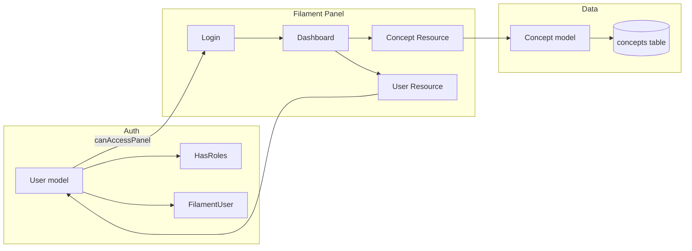

# Filament Admin Backoffice and Concept Rename

## Is Filament appropriate?

**Yes.** Filament is a good fit for this task:

- **FLOSS** – MIT licensed; no cost.
- **Streamlined admin views** – Resources give you list/create/edit (and optional view) per model with tables and forms built from schema; similar workflow to Nova.
- **Laravel 12** – Filament v5 supports Laravel 12.
- **Auth out of the box** – Panel uses Laravel’s web guard (session); you implement `FilamentUser::canAccessPanel()` to restrict access.
- **Extensible** – Roles/permissions via Spatie (or Filament Shield); you only need a simple first step: one `super_admin` role with full access.

**Alternatives (for context):**

- **Laravel Nova** – Paid; you explicitly wanted a FLOSS alternative.
- **Filament Shield** – Plugin on top of Filament that auto-generates policies and a UI for roles/permissions; can be added later if you want a UI to manage roles inside the panel.
- **Backpack for Laravel** – Another FLOSS admin panel; Filament is more widely adopted and aligns with your Nova-like expectation.

**Recommendation:** Proceed with Filament 5 + Spatie Laravel Permission. Use a single role `super_admin` and `Gate::before()` so that role has all permissions without assigning each one. Add Filament Shield or custom role management UI later if needed.

---

## 1. Rename ConceptUrl to Concept (keep behavior intact)

Rename the model and table everywhere so the codebase and admin speak in terms of “Concept” while preserving existing data and behavior.

**Table rename (migration):**

- Add a new migration that renames `concept_urls` to `concepts` (e.g. `Schema::rename('concept_urls', 'concepts')`). No data loss.

**Model and references:**

| Current                                                                                                  | New                                                                                                                                            |
| -------------------------------------------------------------------------------------------------------- | ---------------------------------------------------------------------------------------------------------------------------------------------- |
| `app/Models/ConceptUrl.php`                                                                              | `app/Models/Concept.php` (class `Concept`, `$table = 'concepts'`)                                                                              |
| `ConceptUrlSeeder`                                                                                       | `ConceptSeeder` in [database/seeders/ConceptUrlSeeder.php](database/seeders/ConceptUrlSeeder.php) (file can be renamed to `ConceptSeeder.php`) |
| `ConceptUrlCache`                                                                                        | Keep name; inject and use `Concept` model internally in [app/Services/ConceptUrlCache.php](app/Services/ConceptUrlCache.php)                   |
| [app/Services/ConceptRelationshipService.php](app/Services/ConceptRelationshipService.php)               | Use `Concept` and `Concept::normalizeConcept()`                                                                                                |
| Unit test [tests/Unit/ConceptRelationshipServiceTest.php](tests/Unit/ConceptRelationshipServiceTest.php) | Use `ConceptSeeder`, `concepts` in `assertDatabaseCount` / `assertDatabaseHas`                                                                 |

**Behavior to preserve:**

- `Concept::normalizeConcept()` (same as current `ConceptUrl::normalizeConcept()`).
- Cache service and relationship service logic unchanged; only type hints and model/table names change.
- Any other references to `ConceptUrl` or `concept_urls` (e.g. in feature tests or config) updated to `Concept` / `concepts`.

After this, run the full test suite to confirm everything still works.

---

## 2. Roles and permissions (Spatie + super_admin)

**Packages:**

- Install `spatie/laravel-permission` and run its migration (add after the `concepts` rename migration so order is predictable).

**User model:**

- Add migration: new column `role` on `users` (e.g. string, nullable, or a foreign key to `roles` if you prefer to use Spatie’s roles table from the start).  
**Simpler approach:** Use only Spatie’s `roles` table and assign roles via `$user->assignRole('super_admin')`; no need for a `role` column on `users` if you rely on Spatie.
- Implement `HasRoles` (Spatie) and `FilamentUser` (Filament) on [app/Models/User.php](app/Models/User.php):
  - `canAccessPanel(Panel $panel): bool` → allow only if user has role `super_admin` (e.g. `return $user->hasRole('super_admin');`).

**Super-admin bypass:**

- In `AppServiceProvider::boot()` (or a dedicated provider), register:
`Gate::before(fn ($user, $ability) => $user->hasRole('super_admin') ? true : null);`
so super_admins pass all permission checks without assigning every permission.

**Seeding roles:**

- In a seeder (e.g. `RolePermissionSeeder` or inside `DatabaseSeeder`), create the role `super_admin` once (e.g. `Role::create(['name' => 'super_admin', 'guard_name' => 'web'])`).

---

## 3. Filament panel installation and config

**Install:**

- `composer require filament/filament:"^5.0"` (or `~5.0` on Windows PowerShell).
- `php artisan filament:install --panels`  
This creates [app/Providers/Filament/AdminPanelProvider.php](app/Providers/Filament/AdminPanelProvider.php) and registers the panel (typically at `/admin`). Ensure this provider is listed in [bootstrap/providers.php](bootstrap/providers.php).

**Panel auth:**

- Set the panel’s auth guard to `web` (default) and ensure the auth middleware is applied so only logged-in users hit the panel.
- Panel access is then restricted by `FilamentUser::canAccessPanel()` (super_admin only).

**Optional:** Disable registration for the panel so only seeded or manually created users can log in.

---

## 4. Local-only seed user

**Seeder:**

- Create a seeder (e.g. `AdminUserSeeder`) that:
  - Runs only when `app()->environment('local')` (or `App::environment('local')`).
  - Creates or updates a user with email `test@lateralzr.com` and password `!12345678` (use `Hash::make('!12345678')`).
  - Ensures the `super_admin` role exists (from step 2), then assigns it to this user: `$user->assignRole('super_admin');`
- Call this seeder from [database/seeders/DatabaseSeeder.php](database/seeders/DatabaseSeeder.php) (e.g. `$this->call(AdminUserSeeder::class)` after roles exist). Optionally reduce or remove the existing `User::factory()->create([...])` for `test@example.com` if you want a single canonical local user; otherwise keep both and document both in README.

**Safety:** Use `updateOrCreate` keyed by email so re-running the seeder doesn’t duplicate users; only in local will this user exist.

---

## 5. Filament resources (quick model views)

**Resources to add:**

- **Concept resource** – List table (concept, wiki_url, media_url, timestamps), create/edit forms for the same fields. This replaces “terms” in your mental model with the broader “Concept” and lets you inspect/edit records in `concepts`.
- **User resource (optional but useful)** – Simple list (and optionally view/edit) for admin to see users; hide or restrict password field. Ensures one place to “check models we have in the db.”

**Commands:**

- `php artisan make:filament-resource Concept --generate` (if you use doctrine/dbal for auto schema), or manually define table columns and form fields.
- `php artisan make:filament-resource User --generate` (or manual), then restrict to safe fields and no password display/edit unless you add a dedicated change-password flow.

**Authorization:**

- Policies for `Concept` and `User`: delegate to Spatie or simple `return $user->hasRole('super_admin')` for now. With `Gate::before()` for super_admin, all actions will be allowed for the seeded admin.

---

## 6. Documentation and agent context

**README ([README.md](README.md)):**

- Add a short “Admin backoffice” section:
  - URL: `http://localhost/admin` (or your app URL + `/admin`).
  - Login: `test@lateralzr.com` / `!12345678` (local only; mention that this user is seeded only in local).
  - One-line note that the stack is Filament 5 + Spatie for roles (super_admin).
- In “Next Steps” or “Testing”, mention that after `sail artisan migrate` and `sail artisan db:seed`, the local admin user is available.

**Agent context ([.cursorrules/AGENTS.md](.cursorrules/AGENTS.md)):**

- Add a subsection under architecture or tools: Admin backoffice is built with Filament 5; access is restricted to users with the `super_admin` role; roles/permissions are handled by Spatie Laravel Permission; the first role is `super_admin` with full capabilities; new roles/permissions can be added later.
- Optionally mention the Concept model (renamed from ConceptUrl) and that Filament resources provide quick CRUD for models like Concept and User.

---

## 7. Tests

**Existing tests:**

- All current tests must pass after:
  - Renaming ConceptUrl → Concept and table concept_urls → concepts (update test seeders, DB assertions, and any model references).
  - Adding Spatie migrations (and any new User columns if you add them); tests should run against a clean DB (migrations + seeders as used today).

**New tests (recommended):**

- **Feature:** Admin panel access:
  - Unauthenticated request to `/admin` redirects to login (or 302).
  - Authenticated user without `super_admin` role cannot access panel (403 or redirect).
  - Authenticated user with `super_admin` role can access `/admin` (200 or redirect to dashboard).
- Use the seeded local user in a test that runs in an environment where that user exists, or create a user with `assignRole('super_admin')` in the test and log in via `$this->actingAs($user)` then hit `/admin`.

**Running tests:**

- `sail test` (or `./vendor/bin/sail test`) must pass. No changes to PHPUnit config required unless you add new env or seed conventions.

---

## Implementation order (summary)

1. **Rename ConceptUrl → Concept** – Migration to rename table; new model and seeder; update ConceptUrlCache, ConceptRelationshipService, and all tests.
2. **Spatie + roles** – Install Spatie, run migrations, seed `super_admin` role, User implements HasRoles + FilamentUser, Gate::before for super_admin.
3. **Filament** – Install panel, register provider, configure auth; ensure only super_admin can access panel.
4. **AdminUserSeeder** – Local-only, create/update [test@lateralzr.com](mailto:test@lateralzr.com) with password !12345678 and assign super_admin; call from DatabaseSeeder.
5. **Filament resources** – Concept and User resources; policies or Gate::before only.
6. **README and AGENTS.md** – Backoffice section and agent context.
7. **Tests** – Fix existing tests for Concept/table rename; add admin access tests; run full suite.

---

## Mermaid: high-level flow

This keeps the plan focused, preserves existing behavior after the rename, and delivers a streamlined admin backoffice with login, one role (super_admin), and quick model views for Concept and User, with README and AGENTS.md updated and all tests passing.
