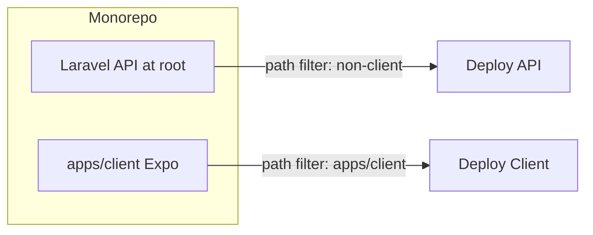

# Expo Client and Monorepo Setup

## Architecture

- **Monorepo layout**: Keep the Laravel API at the **repository root** (no move). Add the Expo app under `**apps/client`**. This avoids a large restructure and keeps Sail/composer at root; CI will use path filters to deploy API vs client independently.
- **Client**: Expo (React Native + TypeScript) with React Native Web for browser development. Primary target: mobile; local dev via iOS/Android emulator or `npx expo start --web`.
- **Independent deployment**: Use path-based triggers in CI (e.g. GitHub Actions): changes under `apps/client/`** deploy only the client; changes outside deploy only the API. **Turborepo** is used from the start so the root (Laravel Admin / Vite) and `apps/client` (Expo) build and dev processes are orchestrated and do not collide.

---

## 1. API: Cold start without user input

Concept chain must start without user input. Two viable approaches:

**Option A – Optional seed (recommended)**  

- Make `seed` **optional** in **POST** `/api/concepts/relationships`.  
- When `seed` is omitted (or empty), the API chooses an initial concept (e.g. random from a fixed list in config, or `Concept::inRandomOrder()->first()?->concept` with a fallback list).  
- Response shape stays the same: `{ data: { seed, related_concepts }, status }`.  
- **Touchpoints**: [app/Http/Controllers/Api/ConceptRelationshipController.php](app/Http/Controllers/Api/ConceptRelationshipController.php) (validation: `seed` → `sometimes|string|...`), [app/Services/ConceptRelationshipService.php](app/Services/ConceptRelationshipService.php) (accept `?string $seedConcept`, resolve random seed when null), and a small config or helper for the list of random seeds / DB fallback.  
- **Tests**: Update [tests/Feature/ConceptRelationshipApiTest.php](tests/Feature/ConceptRelationshipApiTest.php) and any service tests to cover “no seed” and “with seed” cases.

**Option B – Client random selector**  

- Add **GET** `/api/concepts/random-seed` (or similar) returning one term; client calls **POST** `/api/concepts/relationships` with that seed.  
- More flexible later (e.g. A/B test different lists) but extra round-trip and a new endpoint. Can be added later if needed.

**Recommendation**: Implement **Option A** so the client can load the first card stack with a single **POST** and no prior input.

---

## 2. Monorepo structure, Turborepo, and Node version

### 2.1 Root package.json (Vite) and apps/client (Expo) – no collision

The repository already has a **root [package.json](package.json)** used for building the Laravel Admin frontend (Vite, Tailwind, `laravel-vite-plugin`), with scripts `build` and `dev`. This must not interfere with the **apps/client** Expo app, which has its own `package.json` and scripts (`start`, `ios`, `android`, `web`, etc.).

**Approach: Turborepo from the start.**

- **Turborepo** orchestrates tasks per package so the two processes never collide: the root package runs Vite (admin assets); `apps/client` runs Expo (client app). Each has its own dependencies and scripts; Turborepo runs them in isolation and can cache outputs.
- **Root [package.json](package.json)**:
  - Keep existing `build` and `dev` scripts (Vite) so Sail and existing workflows remain unchanged.
  - Add `"name": "admin"` (or `"lateralzr-admin"`) so Turborepo can reference this package.
  - Add `"workspaces": ["apps/*"]` so `apps/client` is a workspace; run `npm install` from root to link workspaces (Expo supports npm workspaces; [Expo monorepo guide](https://docs.expo.dev/guides/monorepos)).
- **Root turbo.json**: Define pipeline tasks (e.g. `build`, `dev`) and map them to each package. Root package’s `build` = `vite build`, `dev` = `vite`; `apps/client`’s `build` = Expo export (or equivalent), `dev` = `expo start`. Optional root script `build:all` or `dev:all` can run `turbo run build` / `turbo run dev` for convenience; day-to-day, run admin from root (`npm run dev`) and client from `apps/client` (`npm run start` or via Turbo with `--filter=client`).
- **apps/client**: New Expo app under `apps/client` with its own `package.json`. No shared script names with root (root uses `build`/`dev`, client uses `start`, `ios`, `android`, `web`), so there is no naming collision. Turborepo’s task resolution is per-package.

Result: Laravel Admin continues to use `npm run build` / `npm run dev` at root; client runs from `apps/client` or via Turbo filters. Processes do not collide.

### 2.2 Node version (host or Docker)

The **Node version** used for the project (Vite and Expo) must be consistent and explicit.

- **Option A – NVM on host (recommended for local dev):**
  - Add a `**.nvmrc`** at the repository root with the desired Node version (e.g. `20` or `22` LTS; Expo and Vite both support Node 18+).
  - Document in README: run `nvm use` (or `nvm install` if needed) in the repo root so both root (Vite) and `apps/client` (Expo) use the same version. Prerequisites section should state “Node 20 (or see .nvmrc)” and point to NVM or similar for version management.
- **Option B – Docker Compose:**
  - Leverage the existing [compose.yaml](compose.yaml) toolset: add an optional **Node service** (e.g. official `node:20-alpine`) that mounts the repo (or `apps/client` only) and runs client install/build/start commands (e.g. `npm ci`, `npm run build`, or `npx expo start`) so the Node version is pinned in the container. This is optional and useful for CI or “no local Node” workflows; document the service and how to run client scripts via `docker compose run node ...` (or similar).
  - Do not change the existing Sail PHP container for Node; keep Node as a separate optional service so API (Sail) and client (Node container or host) remain independent.

README and AGENTS.md should state: Node version is defined by `.nvmrc`; use NVM on the host for local development, or the optional Node Docker service for a containerized client build/run.

### 2.3 Client app layout

- **apps/client**: New Expo app created with `npx create-expo-app@latest apps/client` (TypeScript template). Use **Expo Router** for file-based routing ([Expo docs](https://docs.expo.dev/workflow/overview), [Expo Skills](https://github.com/expo/skills)).
- **Structure** (minimal for the plan):
  - `apps/client/app` – Expo Router routes (`_layout.tsx`, `index.tsx`).
  - `apps/client/components` – Reusable UI (e.g. `ConceptCard`, card stack container).
  - `apps/client/lib` or `apps/client/api` – API client (base URL from env) calling `POST /api/concepts/relationships`.
- **Environment**: `EXPO_PUBLIC_API_URL` (or `EXPO_PUBLIC_LATERALZR_API_URL`) for the API base URL (local, self-hosted, or Laravel Cloud).

---

## 3. Client features (first slice)

- **Data flow**: On first load (and optionally “refreshes”), call **POST** `/api/concepts/relationships` with no body (or `{ "count": 5 }`). Use the returned `seed` + `related_concepts` as the initial list of concept cards.  
- **Cards**:  
  - **Flip**: One card is “current”; tap or button to flip and show description (and other fields: e.g. `shortDescription`, `wikiUrl`, `mediaUrl`). Use React Native’s `Animated` or `react-native-reanimated` for 3D flip (or a simple front/back view swap).  
  - **Swipe**: Horizontal swipe (e.g. `react-native-gesture-handler` + `react-native-reanimated`) to go to next/previous card in the stack.
- **Local dev**: Document and support `npx expo run:ios`, `npx expo run:android`, and `npx expo start --web` so agents and developers can use emulator or browser.

Expo’s [core concepts](https://docs.expo.dev/core-concepts) and [workflow](https://docs.expo.dev/workflow/overview) cover development builds and web; for UI and gestures, [Expo Skills](https://github.com/expo/skills) (e.g. building UI, data fetching) should be used by agents when working in `apps/client`.

---

## 4. README and agent docs (Expo Skills + monorepo)

- **README.md** ([README.md](README.md)):  
  - Add a **Monorepo** section: describe layout (API at root, client in `apps/client`), Turborepo (root = admin/Vite, apps/client = Expo; no script collision), Node version (`.nvmrc` + NVM or optional Node in Docker). How to run the API (existing Sail steps) and the client (`cd apps/client && npx expo start`, or Turbo `--filter=client`; and `--web` / `run:ios` / `run:android`).  
  - Add **Expo client** subsection: prerequisites (Node version per `.nvmrc`, use NVM on host or optional Node Docker service; optional Xcode/Android Studio for native runs), env var `EXPO_PUBLIC_API_URL`, and pointer to Expo docs.  
  - Add **Independent deployment** subsection: high-level note that CI should deploy API when non-client paths change and client when `apps/client/`** changes; no need to specify a CI product.  
  - In **Resources**, add link to [Expo Documentation](https://docs.expo.dev) and [Expo Skills (GitHub)](https://github.com/expo/skills) with a one-line note that Cursor users can add Expo Skills as a Remote Rule for better agent support when working on the client app.
- **Agent context** ([.cursorrules/AGENTS.md](.cursorrules/AGENTS.md)):  
  - Add a **Monorepo** section: API at root, Expo app in `apps/client`; Turborepo orchestrates admin (Vite) and client (Expo) so root and apps/client scripts do not collide. Node version from `.nvmrc` (NVM on host or optional Node Docker service). Agents must not assume a single app (run API tests from root with Sail; run client commands from `apps/client` or via Turbo with `--filter=client`).  
  - Add **Expo client** section: stack (Expo SDK, React Native, TypeScript, Expo Router); that agents should use **Expo AI Skills** when editing or adding client code—install via Cursor: Settings → Rules & Command → Project Rules → Add Rule → Remote Rule (GitHub) → `https://github.com/expo/skills.git`; skills are auto-discovered for prompts about Expo, UI, data fetching, deployment (per [expo/skills README](https://github.com/expo/skills/blob/main/README.md)).  
  - Optionally list useful Expo MCP capabilities (docs, install, simulator/testing) if the project adds Expo MCP later; for this plan, README + AGENTS.md pointing to Expo Skills is enough.

These updates ensure both humans and agents understand the monorepo, how to run and deploy each app, and that they should use Expo Skills when working on the client.

---

## 5. Summary of deliverables

| Area      | Action                                                                                                                                                                                           |
| --------- | ------------------------------------------------------------------------------------------------------------------------------------------------------------------------------------------------ |
| API       | Make `seed` optional in POST `/api/concepts/relationships`; when absent, service picks random seed (config or DB); update controller, service, tests.                                            |
| Repo      | Add Turborepo (root package.json + workspaces, turbo.json); add `.nvmrc`; optional Node service in compose. Add `apps/client` with Expo (TypeScript, Expo Router), API client, env for base URL. |
| Client UI | Implement concept cards with flip (description/extra info) and swipe (next/previous); use first load with no seed.                                                                               |
| Docs      | README: monorepo layout, run API + client, deployment note, Expo + Expo Skills links. AGENTS.md: monorepo rules, Expo client stack, Expo Skills install and usage.                               |
| CI        | (Optional) Add or update workflow with path filters for independent API vs client deployment.                                                                                                    |

---

## 6. Out of scope (for later)

- GET `/api/concepts` or paginated list (only POST relationships + optional seed).  
- Auth, rate limiting, EAS Update configuration.  
- Moving Laravel into `apps/api`.  
- Actual deployment scripts (only document the strategy).

